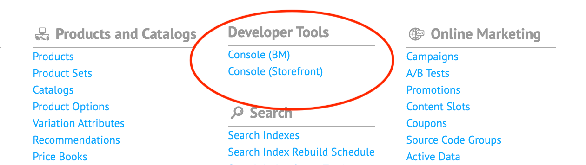

RVW Developers Core - SFCC Cartridge
===

> A Salesforce Commerce Cloud (Demandware) Cartridge for Developers.

[](https://vimeo.com/476962367/5c830f9227 "Play Demo Video")

## Features

- [X] Execute Server Side JavaScript on your Sandbox in your favorite browser
- [X] No Site Preferences or Misc Imports Required, just drop in and go
- [X] Safety Measures to prevent running in Production Environments
- [X] Menu in the business manager (with role management)

Installation
---

[](https://github.com/redvanworkshop/rvw_developers_core/releases/latest)

1. Download Latest Release
2. Unzip and Rename the folder to `rvw_developers_core`
3. Move `rvw_developers_core` into the root of your SFCC Project

### Storefront
To make use of the Dev Console in the context of a storefront site (SiteGenesis / SFRA) do the following:

1. Add `rvw_developers_core` to project or global `.gitignore`
2. Add `rvw_dev_console` to the storefront `Cartridges` Path, do the following:
    * `Administration`
    * `Manage Sites`
    *  On this page click the site you want to add the Dev console to
    *  Go to the tab `Settings`
    *  Add `rvw_dev_console` to the cartridges path

Once installed, you can access the Dev Console on your sandbox at `/on/demandware.store/YOUR_SITE_ID/default/Console-Show` ( change `YOUR_SITE_ID` to your Site ID, e.g. `Sites-Frontend-Webshop` ).

### Business Manager
To make use of the Dev Console in the context of the business manager (jobs, business manager modules) do the following:

1. Add `rvw_developers_core` to project or global `.gitignore`
2. Add `rvw_dev_console` to the Business Manager `Cartridges` Path, do the following actions to accomplish this:
    * `Administration`
    * `Manage Sites`
    *  On this page click `Mange the Business Manager site`
    *  Go to the tab `Settings`
    *  Add `rvw_dev_console` to the cartridges path
3. Do the following actions in the Business Manager:
    * `Administration`
    * `Roles & Permissions`
    *  Click on your role
    * `Business Manager Modules`
    *  Assign rights here (Both on `Organization` level & the `Sites` you want to use this on)
4. To get the link `Console (Storefront)` to work, you need to assign the `rvw_dev_console` cartridge to your Storefront site by following the steps in the Storefront installation guide.


After configuration in the Business Manager you should see a new menu item in the `Administrator` & `Merchant Tools` menu.



### Troubleshooting
#### I am unable to load the console
You may need to temporarily switch Code Versions, then switch back to trigger the update in Business Manager.

#### I am unable to see the Business Manager modules in the Roles & Permissions
You may need to temporarily switch Code Versions, then switch back to trigger the update in Business Manager.

#### I clicked the link Console (Storefront), but I am getting a 404 page
In order for this link to work you need to follow the Storefront installation steps.

Sandbox Security
---

> Our `rvw_dev_console` cartridge will allow anyone with access to your sandbox to be able to run code.

If you wish to lock down your sandbox, SFCC already provides a solution to protect it.

1. Head over to `Administration > Sites > Manage Sites`
2. Select your Site Name under `Storefront Sites`
3. Click the `Site Status` tab
4. Set `Select the Site Status` to `Online (Protected)`
5. Enter a `Password` and click `Apply`

Once this is set up, anytime you login to your storefront from a new browser, you will need to enter the username `storefront` and the password you just created. Your login info will be saved as long as you do not clear your browser's cookies. The Chrome plugin [Demandware with Ease](https://chrome.google.com/webstore/detail/demandware-with-ease/ffhabonelknmejmdnekedmijlhebpcio) provides the ability to automatically login with a Storefront Password.

Use cases
---
### Storefront
* Execute code using your storefront session
* View objects from the current customer session
* ... whatever you can imagine

### Business Manager
* Execute code using your Business Manager session
* Execute code as if it is a Business Manager Page
* Execute code in the same context as Jobs
* ... whatever you can imagine

Contributing
---

> Interested in making this tool better?  Fork this Repository and we'll gladly accept Pull Requests.

#### Developer Setup:

```bash
git clone https://github.com/redvanworkshop/rvw_developers_core.git
cd rvw_developers_core
npm install
npm run dev # one time build for development
npm run watch # watch for changes and build for development
npm run build # one time build for production
```

Once you have something you would like to share, check out our Contribution Guide.

[](https://github.com/redvanworkshop/rvw_developers_core/blob/develop/.github/CONTRIBUTING.md)

Disclaimer
---

> The trademarks and product names of Salesforce®, including the mark Salesforce®, are the property of Salesforce.com. Red Van Workshop is not affiliated with Salesforce.com, nor does Salesforce.com sponsor or endorse the Red Van Workshop products or website. The use of the Salesforce® trademark on this project does not indicate an endorsement, recommendation, or business relationship between Salesforce.com and Red Van Workshop.
