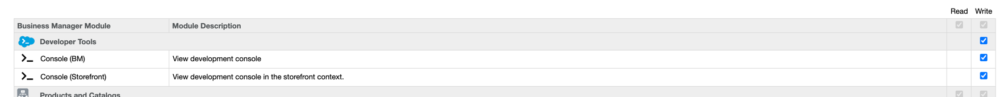

Dev Console
===

> A Salesforce Commerce Cloud (Demandware) Cartridge for Developers.

## Features

- [X] Execute Server Side JavaScript on your Sandbox in your favorite browser
- [X] No Site Preferences or Misc Imports Required, just drop in and go
- [X] Safety Measures to prevent running in Production Environments
- [X] Menu in the Business Manager (with role management)

Installation
---

1. [Install Cartridge](../../README.md#installation)
2. Add `sfcc_dev_console` to Business Manager Storefront `Cartridges` Path
3. Once installed, you can access the Dev Console on your sandbox at `/on/demandware.store/YOUR_SITE_ID/default/Console-Show` ( change `YOUR_SITE_ID` to your Site ID, e.g. `Sites-Site` ).

Business Manager
---

To make use of the Dev Console in the context of the Business Manager (jobs, business manager modules) do the following:

1. Add `sfcc_developers_core` to project or global `.gitignore`
2. Add `sfcc_dev_console` to the Business Manager `Cartridges` Path, do the following actions to accomplish this:
    * `Administration`
    * `Manage Sites`
    *  On this page click `Mange the Business Manager site`
    *  Go to the tab `Settings`
    *  Add `sfcc_dev_console` to the cartridges path
3. Do the following actions in the Business Manager:
    * `Administration`
    * `Roles & Permissions`
    *  Click on your role
    * `Business Manager Modules`
    *  Assign rights here (Both on `Organization` level & the `Sites` you want to use this on)
4. To get the link `Console (Storefront)` to work, you need to assign the `sfcc_dev_console` cartridge to your Storefront site by following the steps in the Storefront installation guide.
    

    After configuration in the Business Manager you should see a new menu item in the `Administrator` & `Merchant Tools` menu.

    

Use cases
---
### Storefront

* Execute code using your storefront session
* View objects from the current customer session

### Business Manager

* Execute code using your Business Manager session
* Execute code as if it is a Business Manager Page
* Execute code in the same context as Jobs

Troubleshooting
---
#### I am unable to load the console

You may need to temporarily switch Code Versions, then switch back to trigger the update in Business Manager.

#### I am unable to see the Business Manager modules in the Roles & Permissions

You may need to temporarily switch Code Versions, then switch back to trigger the update in Business Manager.

#### I clicked the link Console (Storefront), but I am getting a 404 page

In order for this link to work you need to follow the Storefront installation steps.

Sandbox Security
---

> Our `sfcc_dev_console` cartridge will allow anyone with access to your sandbox to be able to run code.

If you wish to lock down your sandbox, SFCC already provides a solution to protect it.

1. Head over to `Administration > Sites > Manage Sites`
2. Select your Site Name under `Storefront Sites`
3. Click the `Site Status` tab
4. Set `Select the Site Status` to `Online (Protected)`
5. Enter a `Password` and click `Apply`

Once this is set up, anytime you login to your storefront from a new browser, you will need to enter the username `storefront` and the password you just created. Your login info will be saved as long as you do not clear your browser's cookies. The Chrome plugin [Demandware with Ease](https://chrome.google.com/webstore/detail/demandware-with-ease/ffhabonelknmejmdnekedmijlhebpcio) provides the ability to automatically login with a Storefront Password.
